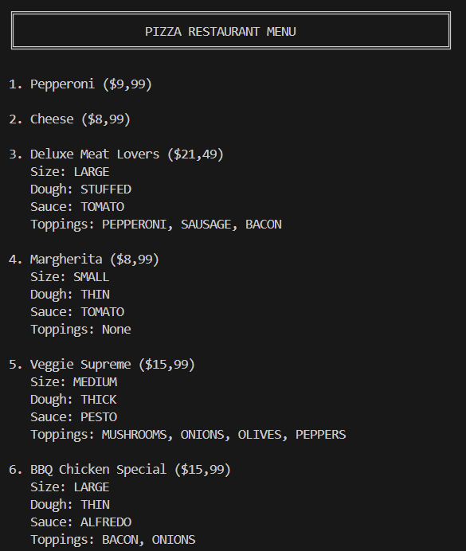

# Laboratory Work #1 - Creational Design Patterns

### Course: TMPS
### Author: Janeta Grigoras, FAF-231
### Due date: 31.10.2025

## Theory
This lab focused on **Creational Design Patterns**, which provide various object creation mechanisms that increase flexibility and reuse of existing code. There are five main creational patterns:

1. **Singleton Pattern**

    Ensures a class has only one instance and provides a global point of access to it.
    This pattern is useful when exactly one object is needed to coordinate actions across the system, such as a configuration manager or connection pool.


2. **Factory Method Pattern**

    Defines an interface for creating an object, but lets subclasses decide which class to instantiate. Factory Method lets a class defer instantiation to subclasses.
    This pattern provides a way to encapsulate object creation logic and makes the code more flexible and maintainable.


3. **Abstract Factory Pattern**

    Provides an interface for creating families of related or dependent objects without specifying their concrete classes.
    This pattern is useful when the system needs to be independent of how its objects are created, composed, and represented.


4. **Builder Pattern**

    Separates the construction of a complex object from its representation, allowing the same construction process to create different representations.
    It provides a step-by-step approach to constructing objects and is especially useful when dealing with objects that have many optional parameters.


5. **Prototype Pattern**

    Specifies the kinds of objects to create using a prototypical instance, and creates new objects by copying this prototype.
    This pattern is useful when the cost of creating a new instance of a class is more expensive than copying an existing instance.


**For this laboratory work, I implemented three of these patterns: Singleton, Factory Method, and Builder.**

## Task

The task is to implement three creational design patterns.
I chose to implement a **pizza ordering system** that demonstrates how different patterns work together to create a flexible and maintainable application.

## Implementation

The pizza ordering system consists of the following classes:
```
Lab1
|
├─ domain
│  ├─ factorymethod
│  │  ├─ PizzaFactory.java
│  │  ├─ CheesePizzaFactory.java
│  │  ├─ PepperoniPizzaFactory.java
│  │  └─ VeggiePizzaFactory.java
│  │
│  ├─ builder
│  │  ├─ IPizzaBuilder.java
│  │  ├─ PizzaBuilder.java
│  │  └─ PizzaDirector.java
│  │
│  └─ singleton
│     └─ MenuManager.java
│
├─ models
│  ├─ Pizza.java
│  ├─ CheesePizza.java
│  ├─ PepperoniPizza.java
│  ├─ VeggiePizza.java
│  └─ CustomPizza.java
│
└─ client
   └─ Main.java
```

### Detailed Component Description:

- **domain/factorymethod**
  - `PizzaFactory` (abstract class) – Defines the factory method contract for creating base pizzas.
  - `CheesePizzaFactory` (class) – Creates CheesePizza instances with base price.
  - `PepperoniPizzaFactory` (class) – Creates PepperoniPizza instances with base price.
  - `VeggiePizzaFactory` (class) – Creates VeggiePizza instances with base price.
  - Demonstrates **Factory Method Pattern** by encapsulating pizza creation logic.

- **domain/builder**
  - `IPizzaBuilder` (interface) – Defines the builder contract with methods for setting pizza attributes (size, dough, sauce, toppings). Also contains enums for Size, Dough, Sauce, and Topping.
  - `PizzaBuilder` (class) – Implements IPizzaBuilder. Takes a base pizza from a factory and builds a CustomPizza with all customizations. Calculates final price based on size, dough type, and toppings.
  - `PizzaDirector` (class) – Uses the builder to construct predefined pizza recipes (menu items). Demonstrates **Director pattern** for creating complex objects with preset configurations.

- **domain/singleton**
  - `MenuManager` (class) – Singleton that manages the pizza menu. Uses eager initialization to ensure thread safety. Holds a collection of menu items created by the Director.

- **models**
  - `Pizza` (class) – Base class for all pizzas. Contains name, price, and availability status.
  - `CheesePizza`, `PepperoniPizza`, `VeggiePizza` (classes) – Simple base pizza types created by factories. Only contain name and base price.
  - `CustomPizza` (class) – Extends Pizza with additional fields for customization (dough, sauce, toppings, size, baseType). This is the product created by the Builder.

- **client**
  - `Main` (class) – Demonstrates the system: gets MenuManager singleton, displays menu items showing how patterns work together.

## How the Patterns Work Together

```
1. Factory Method creates base pizzas (Cheese, Pepperoni, Veggie)
         ↓
2. Builder takes a base pizza and customizes it (size, dough, sauce, toppings)
         ↓
3. Director uses Builder to create predefined menu recipes
         ↓
4. Singleton MenuManager holds and manages all menu items
```

## Results



## Conclusions

This laboratory work provided hands-on experience with three fundamental creational design patterns and demonstrated how they can work together in a cohesive system.

The **Factory Method pattern** showed how to encapsulate object creation and make the system extensible for new product types. The **Builder pattern** demonstrated an elegant solution for constructing complex objects with many optional parameters, avoiding constructor pollution and improving code readability. The **Singleton pattern** illustrated how to manage shared resources and ensure a single point of access for critical system components.

By implementing a pizza ordering system, I learned that design patterns are not isolated solutions but can be combined effectively to create flexible, maintainable architectures. The Factory creates simple base products, the Builder customizes them into complex objects, the Director automates common configurations, and the Singleton manages the resulting menu, each pattern playing a specific role in the overall design.