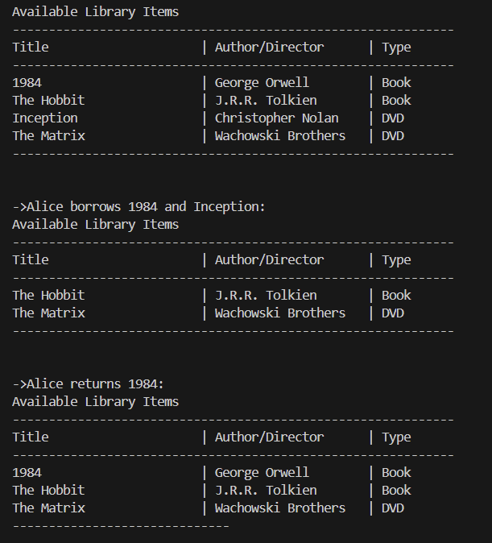

# Laboratory Work #0 - SOLID

### Course: TMPS
### Author: Janeta Grigoras, FAF-231
### Due date: 17.10.2025

## Theory
This lab focused on SOLID principles, which are five fundamental design guidelines that help write clean, maintainable, and scalable code:

1. Single Responsibility Principle (SRP)

    Every piece of software (i.e. module, class or function) should be responsible over a single part of functionality provided by the software.
    Being responsible only for one thing, it will have only one reason to change.


2. Open/Closed Principle (OCP)

    Each piece of software should be open for extension and closed for modification.
    The behavior should be extended without needing to modify the internals.


3. Liskov Substitution Principle (LSP)

    Objects of a class should be substitutable with instances of the existing subclasses, without altering the functionalities of the software.
    

4. Interface Segregation Principle (ISP)

    A client shouldn’t be forced to implement an interface, or methods from an interface, that it doesn’t use.
    It is recommended to split larger interfaces into multiple smaller ones.


5. Dependency Inversion Principle (DIP)

    Software entities must depend on abstractions, not on concrete things. 
    Separate modules, that are located on different levels must not depend directly on each other, but should rely on abstractions.

## Task

The task is to implement three SOLID principles.
I chose to implement a **library system** that manages library items, allowing members to borrow and return items.

## Implementation

The library system consists of the following classes
```
Lab1
|
├─ borrowables
│ ├─ Borrowable.java
│ └─ BorrowableItem.java
│
├─ items
│ ├─ Item.java
│ ├─ Book.java
│ └─ DVD.java
│
├─ Main.java
├─ Library.java
└─ Member.java
```
- **borrowables**
  - `Borrowable` (interface) – Defines the methods for borrowing, returning, and checking availability of items.
  - `BorrowableItem` (class) – Wraps an `Item` to make it borrowable. Implements the `Borrowable` interface. Demonstrates Open-Closed Principle (OCP) because new borrowable types can be added without modifying this class.

- **items**
  - `Item` (class) – Base class for all library items. Stores common attributes like `title`.  
  - `Book` (class) – Inherits from `Item`. Stores book-specific data like author, ISBN, and genre.
  - `DVD` (class) – Inherits from `Item`. Stores DVD-specific data like director, genre, and duration. 

- **Library** (class) – Manages a collection of `Borrowable` items, allows borrowing and returning items. Depends only on the `Borrowable` interface.

- **Member** (class) – Represents a library member with a name and ID.

- **Main** (class) – Demonstrates the system in action: adding items, borrowing, returning, and displaying available items.

## Results



### How SOLID principles are applied:

* SRP: Each class handles one responsibility:
    * `Book` and `DVD` store data related to either books or DVDs.
    * `BorrowableItem` manages borrowing logic.
* OCP: 
    * `BorrowableItem` is open for extension but closed for modification.
    * If I decide to add any new Item subclass, I then can easily wrap it in a `BorrowableItem` without changing the existing code.
* LSP:
    * `Book` and `DVD` can replace `Item` anywhere, without breaking the logic.
* Optional (a plus):
    * ISP: The `Borrowable` interface is small and focused, only requiring methods relevant to borrowing.
    * DIP: `Library` depends on the `Borrowable` interface, rather than concrete classes like `Book` or `DVD`.

## Conclusions

This laboratory work allowed me to understand the SOLID principles more thoroughly and see how they can be applied in a real-world scenario. By implementing a library system, I learned how to design classes with single responsibilities, extend functionality without modifying existing code, and depend on abstractions rather than concrete implementations.  

This exercise helped me appreciate the importance of writing clean, maintainable, and scalable code. Understanding and applying these principles will guide me in future projects, making it easier to manage complex systems, reduce bugs, and collaborate effectively with other developers.

