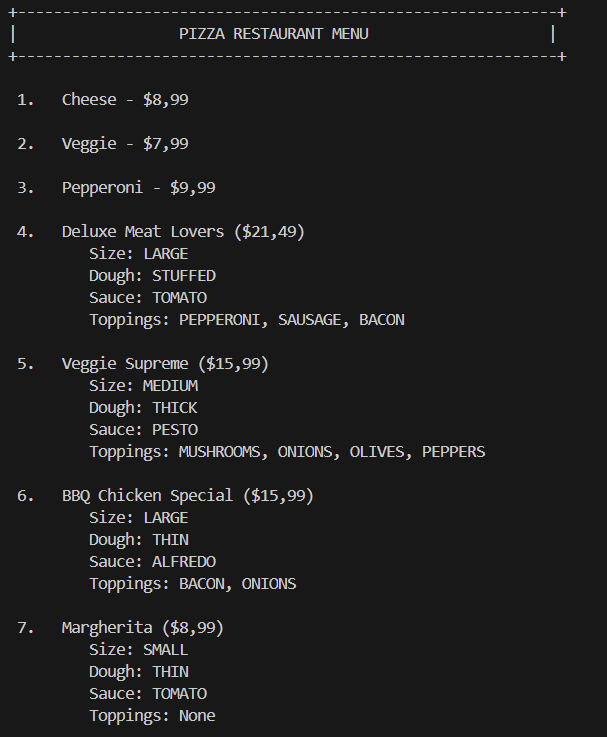
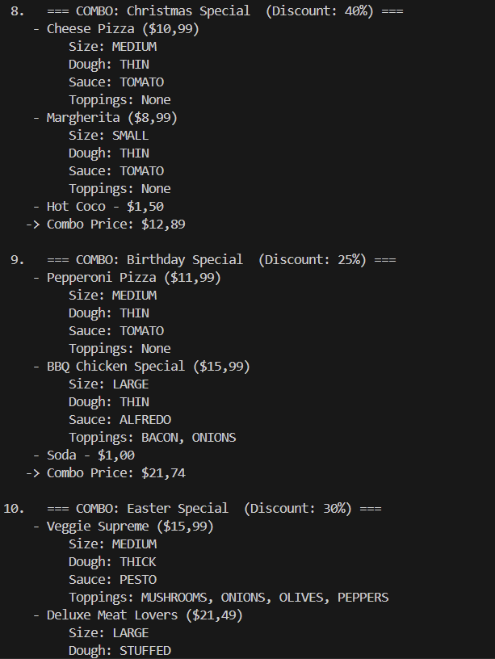
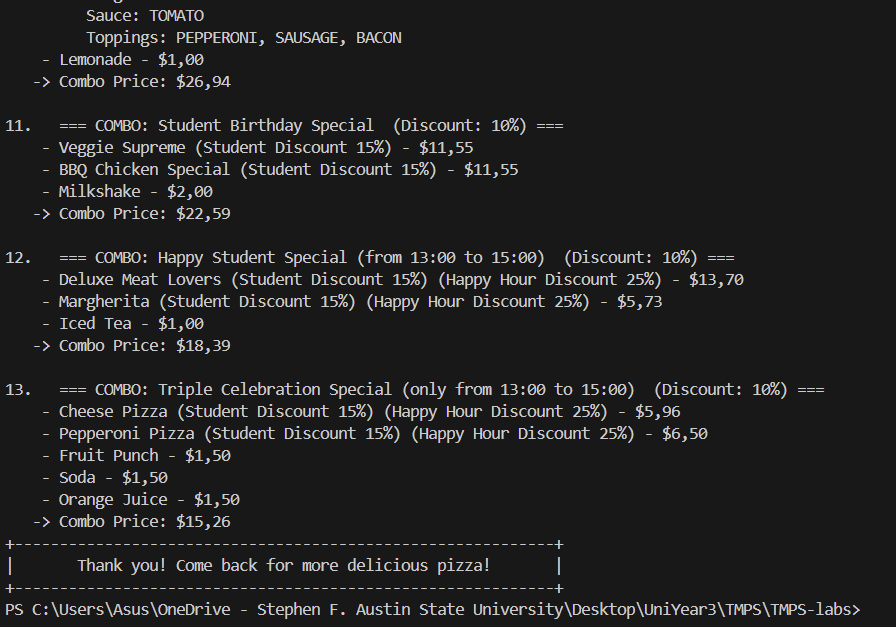

# Laboratory Work #2 - Structural Design Patterns

### Course: TMPS
### Author: Janeta Grigoras, FAF-231
### Date: 15.11.2025

## Theory

**Structural Design Patterns** deal with how objects and classes are combined to form larger structures. They help ensure that these relationships remain flexible and efficient as the system grows. There are seven main structural patterns:

1. **Adapter Pattern**

Allows objects with incompatible interfaces to work together.
It acts like a translator between two classes so that one can use the functionality of another without altering existing code.
Useful when integrating old components into new systems.

2. **Bridge Pattern**

Separates an abstraction from its implementation so both can evolve independently.
Instead of binding them tightly together, it creates layers, making code easier to extend and maintain.

3. **Composite Pattern**

Lets you treat individual objects and groups of objects in the same way.
Great for representing hierarchical structures like folders, menus, or UI components.
It allows clients to interact with a single object or a whole group using the same commands.

4. **Decorator Pattern**

Adds responsibilities or features to an object dynamically, without modifying its class.
This provides a flexible alternative to subclassing for extending functionality — like adding toppings to a pizza without changing the base pizza class.

5. **Facade Pattern**

Provides a simplified interface to a complex system.
Instead of dealing with many complicated classes, the client interacts with just one “front door” object that handles everything internally.
Helps reduce dependencies and improve usability.

6. **Flyweight Pattern**

Minimizes memory usage by sharing common data between similar objects.
Useful when you have tons of objects that mostly look alike — like characters in a text editor or tiles in a map.

7. **Proxy Pattern**

Provides a placeholder or substitute for another object to control access to it.
It can delay creation, manage permissions, or add extra behavior like logging.
Essentially, it stands in front of the real object and decides how and when it should be used.

**For this laboratory work, I implemented four of these patterns: Composite, Facade, Adapter, Decorator.**

## Task

The task is to implement three structural design patterns.
I chose add them to the **pizza ordering system** from the previous lab.

## Implementation

The extended pizza ordering system (Lab2) includes structural patterns and the existing creational pieces from Lab1. Project layout:

```
Lab2
|
├─ domain
│  ├─ factorymethod
│  │  ├─ PizzaFactory.java
│  │  ├─ CheesePizzaFactory.java
│  │  ├─ PepperoniPizzaFactory.java
│  │  └─ VeggiePizzaFactory.java
│  
│  ├─ builder
│  │  ├─ PizzaBuilder.java
│  │  └─ PizzaDirector.java
│  
│  ├─ singleton
│  │  └─ MenuManager.java
│  
│  ├─ decorator
│  │  ├─ PriceDecorator.java
│  │  ├─ HappyHourDecorator.java
│  │  ├─ StudentDiscountDecorator.java
│  │  └─ BirthdayDecorator.java
│  
│  ├─ adapter
│  │  └─ PizzaAdapter.java
│  
│  ├─ composite
│  │  ├─ MenuComponent.java
│  │  ├─ ComboDeal.java
│  │  └─ Drink.java
│  
│  └─ facade
│     └─ MenuFacade.java

├─ models
│  ├─ Pizza.java
│  ├─ CheesePizza.java
│  ├─ PepperoniPizza.java
│  ├─ VeggiePizza.java
│  └─ CustomPizza.java
|
└─ client
	 └─ Main.java
```

### Detailed Component Description:

- **domain/decorator**
	- `PriceDecorator` – Base decorator that wraps a Pizza object and allows modifying price/description behavior.
    - `HappyHourDecorator`, `StudentDiscountDecorator`, `BirthdayDecorator` – Concrete decorators that apply specific discounts or promotions at runtime.
    - Demonstrates the Decorator Pattern, where extra features (like discounts) are added dynamically without modifying the original pizza class.

- **domain/adapter**
	- `PizzaAdapter` – Wraps a `Pizza` object so it can be used where a `MenuComponent` is expected in the `Composite` structure.
    - Demonstrates the `Adapter` Pattern, allowing the `Pizza` class (which doesn’t originally implement `MenuComponent`) to fit seamlessly into the menu hierarchy.

- **domain/composite**
	- `MenuComponent` – Common abstraction for both individual menu items and grouped items.
    - `ComboDeal` – Composite object that contains multiple menu elements.
    - `Drink` – **Leaf** component representing a single non-divisible item.
    - Demonstrates the `Composite` Pattern, enabling both individual and grouped menu items to be handled uniformly (e.g., pricing and display).

- **domain/facade**
	- `MenuFacade` – A concrete class that provides simplified access to the menu subsystem (e.g., adding, retrieving, and displaying menu items).
    - Demonstrates the `Facade` Pattern, which exposes a single, easy-to-use interface to multiple underlying components, reducing complexity for the client.

## How the Patterns Work Together

```
1. Factory Method creates basic pizza types (Cheese, Pepperoni, Veggie)
				 ↓
2. Builder customizes a base pizza into a `CustomPizza` (size, dough, sauce, toppings)
				 ↓
3. Decorators wrap pizzas to apply dynamic pricing/promotions (happy-hour, student, birthday)
				 ↓
4. Composite bundles menu items into combos (pizza + drink) to present menu deals
				 ↓
5. Facade (`MenuFacade`) exposes a simple API for clients and uses adapter/manager components internally
				 ↓
6. Singleton `MenuManager` stores and manages the resulting menu items
```

## Results

The application demonstrates structural patterns layered on top of the creational foundation. The `MenuFacade` and `MenuManager` coordinate factories, builders, decorators, and composite items to present a flexible menu. Example output:





## Conclusions

In this laboratory work, I improved the pizza ordering system by adding four structural design patterns: **Adapter**, **Decorator**, **Composite**, and **Facade**. These patterns helped structure the code better, allowing pizzas to gain new behaviors at runtime, be grouped into combos, and be accessed through a simplified interface.

This lab showed me how structural patterns make a system easier to extend and maintain as it grows. The experience helped strengthen my understanding of clean architecture and will be useful in future projects where flexibility and scalability are important.