# Laboratory Work #3 - Behavioral Design Patterns

### Course: TMPS
### Author: Janeta Grigoras, FAF-231
### Date: 30.11.2025

## Theory

**Behavioral Design Patterns** focus on how objects interact and communicate while distributing responsibilities more efficiently.
They help systems become more flexible, maintainable, and easier to extend without modifying existing code.

1. **Strategy Pattern**

Selects different algorithms or behaviors at runtime based on context.
Allows swapping logic (like sorting methods) without modifying existing code.

2. **Command Pattern**

Encapsulates a request as an object.
Enables undo/redo, action history, task queues, and delayed execution.

3. **Observer Pattern**

Creates a dependency where multiple objects automatically get notified when one changes.
Useful for logs, live updates, or event-based systems.

4. **Iterator Pattern**

Provides a standardized way to traverse elements in a collection without exposing its internal structure.
Perfect for navigating through combos or hierarchical menus.

5. **Memento Pattern**

Captures and restores an object’s state without exposing internal details.
Useful for rollback or restoring previous versions of data.

6. **Template Method Pattern**

Defines the structure of an algorithm while allowing subclasses to override specific steps.
Keeps logic consistent while supporting customization.

7. **Chain of Responsibility Pattern**

Allows requests to be passed through a chain of handlers until one processes it.
Useful for permissions, filtering, or layered validation.

8. **State Pattern**

Changes an object’s behavior when its internal state changes.
Instead of conditionals everywhere, each state defines its own behavior (e.g., “Active Order” vs. “Confirmed Order”).

9. **Visitor Pattern**

Adds new operations to objects without modifying their classes.
Visitors "visit" different object types and apply behavior. Useful for export, statistics, or reporting.

10. **Mediator Pattern**

Centralizes communication between objects to reduce direct coupling.
Instead of objects talking to each other directly, a Mediator coordinates interactions.

**For this laboratory work, I implemented three of these patterns: Strategy, Command, and Observer.**

## Task

The task is to implement three behavioral design patterns.
I chose add them to the **pizza ordering system** from the previous lab.

## Implementation

The extended pizza ordering system (Lab3) includes behavioral patterns and the existing creational and structoral pieces from Lab1 and Lab2. Project layout:

```
Lab2
|
├─ domain
│  ├─ strategy
│  │  ├─ Strategy.java
│  │  ├─ NameStrategy.java
│  │  └─ PriceStrategy.java
│  │
│  ├─ command
│  │  ├─ OrderCommand.java
│  │  ├─ AddItemCommand.java
│  │  ├─ RemoveItemCommand.java
│  │  ├─ ConfirmOrderCommand.java
│  │  └─ CommandInvoker.java
│  │
│  ├─ observer
│  │  ├─ Observer.java
│  │  ├─ AdminLogger.java
│  │
│  ├─ factorymethod
│  │  ├─ PizzaFactory.java
│  │  ├─ CheesePizzaFactory.java
│  │  ├─ PepperoniPizzaFactory.java
│  │  └─ VeggiePizzaFactory.java
│  |
│  ├─ builder
│  │  ├─ PizzaBuilder.java
│  │  └─ PizzaDirector.java
│  |
│  ├─ singleton
│  │  └─ MenuManager.java
│  |
│  ├─ decorator
│  │  ├─ PriceDecorator.java
│  │  ├─ HappyHourDecorator.java
│  │  ├─ StudentDiscountDecorator.java
│  │  └─ BirthdayDecorator.java
│  |
│  ├─ adapter
│  │  └─ PizzaAdapter.java
│  |
│  ├─ composite
│  │  ├─ MenuComponent.java
│  │  ├─ ComboDeal.java
│  │  └─ Drink.java
│  |
│  └─ facade
│     └─ MenuFacade.java

├─ models
│  ├─ Pizza.java
│  ├─ CheesePizza.java
│  ├─ PepperoniPizza.java
│  ├─ VeggiePizza.java
│  ├─ CustomPizza.java
|  └─ Order.java
|
└─ client
	 └─ Main.java
```

### Detailed Component Description:

- **domain/strategy**
	- `PriceDecorator` – Base decorator that wraps a Pizza object and allows modifying price/description behavior.
    - `HappyHourDecorator`, `StudentDiscountDecorator`, `BirthdayDecorator` – Concrete decorators that apply specific discounts or promotions at runtime.
    - Demonstrates the Decorator Pattern, where extra features (like discounts) are added dynamically without modifying the original pizza class.

- **domain/adapter**
	- `Strategy` - Interface that defines the common behavior (sort()) for all sorting algorithms.
    
        It allows menu items to be sorted in different ways without modifying the menu itself.

    - `NameStrategy` & `PriceStrategy` - **Concrete strategies** that implement the sorting behavior:

        - `NameStrategy` sorts menu components alphabetically, improving readability for users browsing the menu.

        - `PriceStrategy` sorts items by cost, helping budget-focused customers quickly find cheaper options.

    - `MenuFacade` - Acts as the **Context**, holding a reference to the currently selected strategy.
        
        It allows switching sorting logic at runtime through **setStrategy()** and uses the strategy inside **sortMenu()**.

- **domain/observer**
	- `Observer` - The interface that defines the **update()** method.
        
        Any class that needs to react to menu changes implements this interface.

    - `AdminLogger` - A **Concrete Observer** that receives notifications whenever changes occur in the system.

        It logs updates like:

        ```[ADMIN LOG]: Item added to menu```

        This ensures administrators are always informed about important menu updates.

    - MenuManager – Acts as the `Subject` (`Publisher`).

        It stores a list of subscribed observers and notifies them through **notifyObservers()** every time a:

        - Menu item is added

        - Menu item is removed

- **domain/command**
	- `OrderCommand` - The Command interface. Declares the actions **execute()** and **undo()** that all commands must provide.

        This allows every customer action (add/remove/confirm) to be treated the same way.

    - `AddItemCommand` - **Concrete Command** that adds a menu item to the current order.

        It keeps track of the added item’s index so it can be undone later.
        - **undo()** removes the previously added item.

    - `RemoveItemCommand` - **Concrete Command** that removes an item from the order.
        
        It stores the removed item so it can be restored if the user undoes the action.

        - undo() adds the item back to the order.

    - `ConfirmOrderCommand` - **Concrete Command** that finalizes the order.

        If undone, the order returns to an editable state, providing rollback functionality.
        - undo() reverses confirmation.

    - CommandInvoker – **Invoker**. Holds a history (stack) of executed commands.

        It does not know the details of the actions - it simply triggers commands and supports undo:

        - **executeCommand()** runs actions and logs them

        - **undoLastCommand()** pops and reverses the most recent action

    - `Order` - **Receiver**. Executes the real business logic:

        - Adding menu components

        - Removing menu components

        - Confirming or unconfirming an order


## Results

### Admin Mode Behavior

When an administrator adds or removes menu items, the system immediately logs those actions.
This happens because the menu notifies all observers, in this case, the `AdminLogger`.
As a result, every change to the menu is tracked, which proves the Observer Pattern is working properly.

Sorting the menu can be changed at any moment.
For example, the admin switched from sorting by name to sorting by price.
The menu updated instantly, showing that different sorting strategies can be swapped during runtime.
This confirms the correct use of the **Strategy Pattern**.

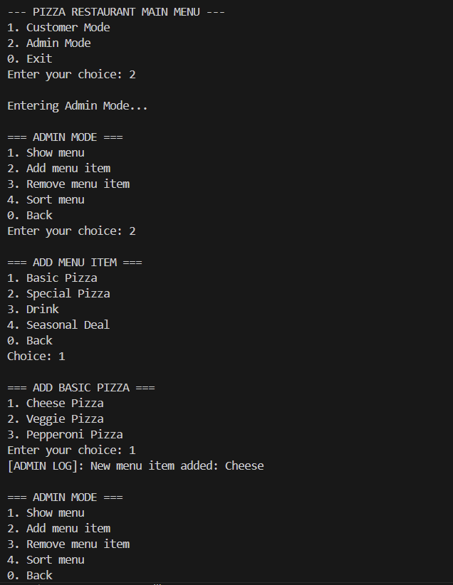
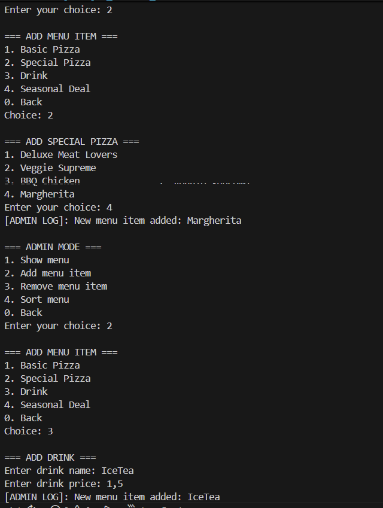
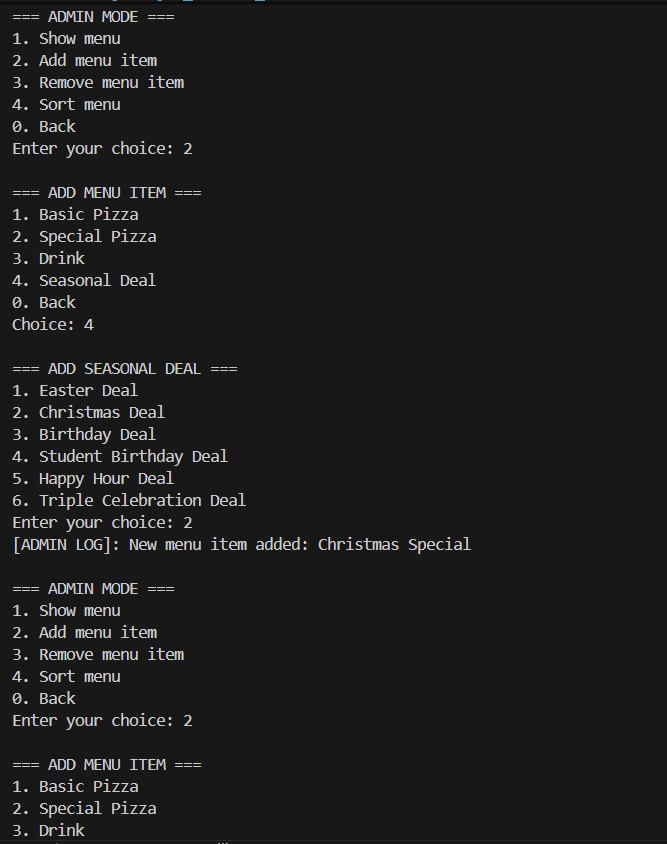
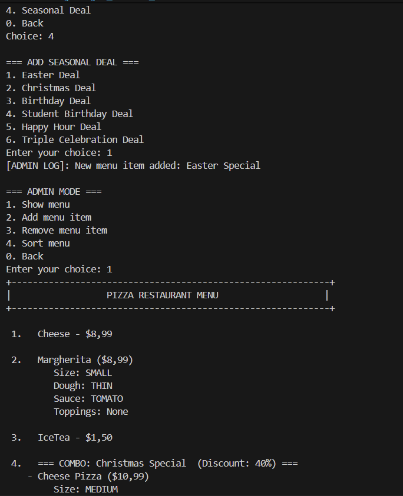
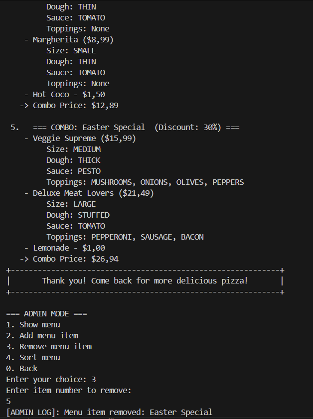
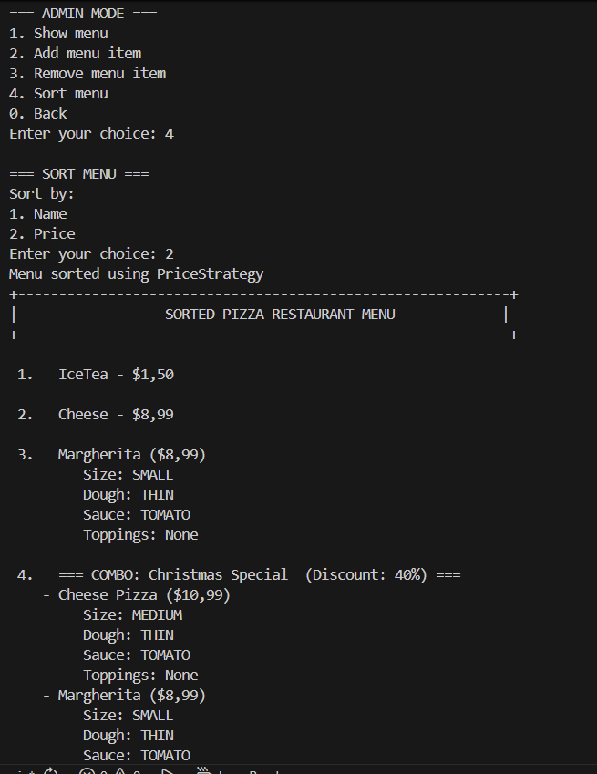

### Customer Mode Behavior

Customers are able to build their own order by adding or removing items.
Every operation that modifies the order is recorded as a command, allowing it to be undone later.
For example, after adding a pizza by mistake, the user undid the action successfully and the item was removed from the order.
This demonstrates that the Command Pattern is properly encapsulating actions and supporting undo functionality.

Once the order is confirmed, the system temporarily locks further editing.
However, if the confirmation was a mistake, the user can still revert it - the order returns to an editable state.

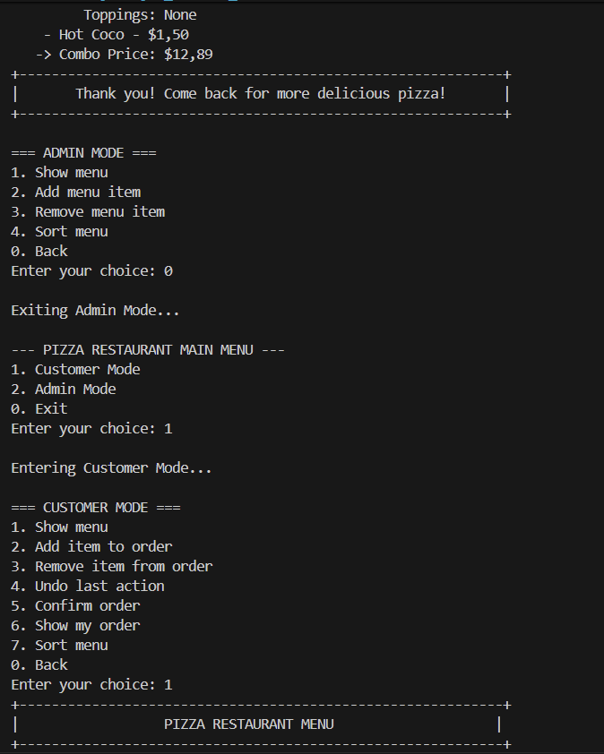
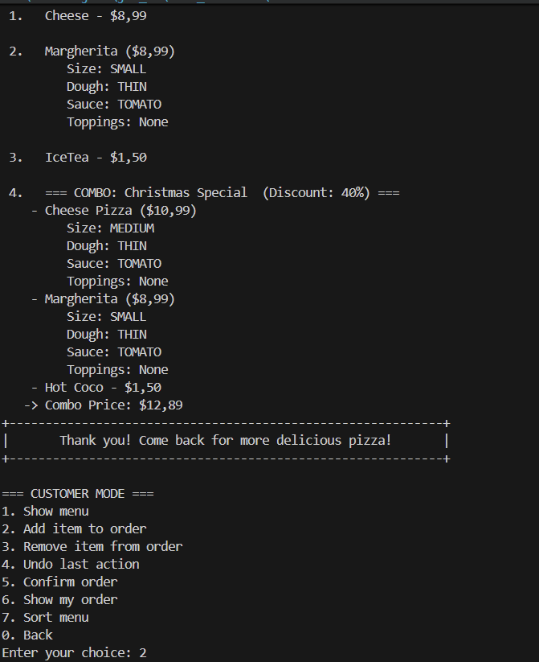
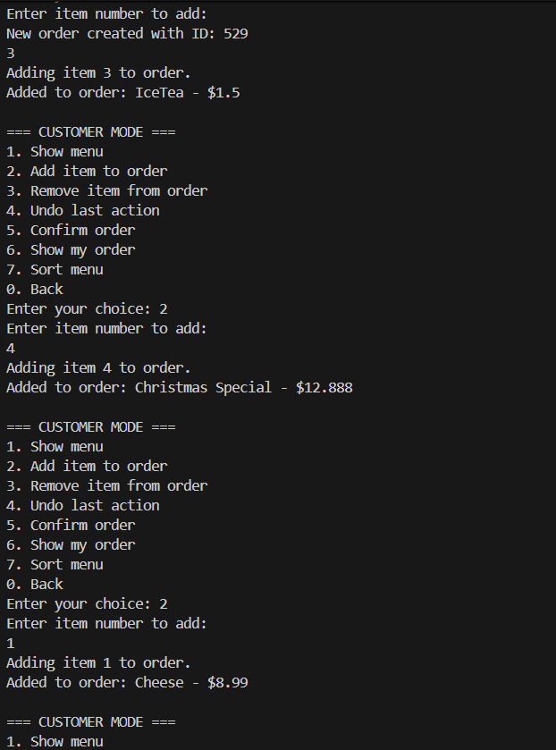
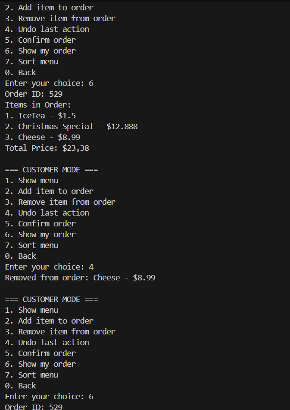
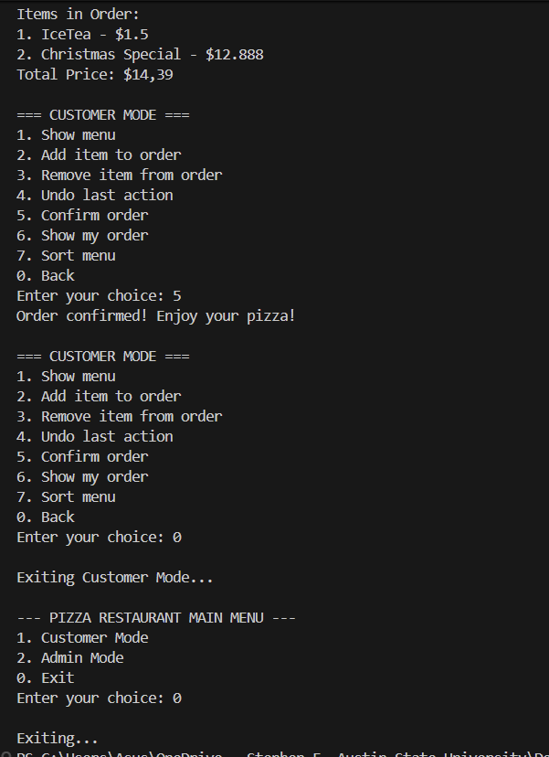

## Conclusions

In this laboratory work, I improved the pizza ordering system by implementing several behavioral patterns: Strategy, Command, and Observer. These patterns helped make the system more interactive, flexible, and easier to modify. I learned how user actions can be undone, observed, and handled dynamically without changing the core logic.

This experience showed me how behavioral patterns simplify communication between objects and enhance maintainability as the system grows. The knowledge gained will be useful in real-world applications where user interaction and state management are important, helping me design more scalable and professional software in the future.